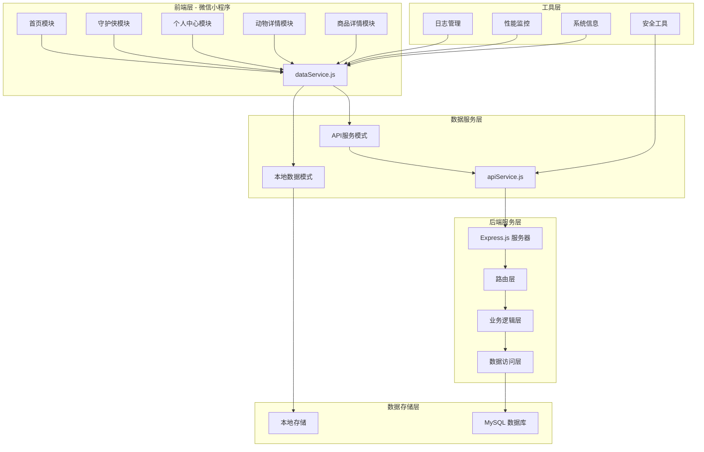
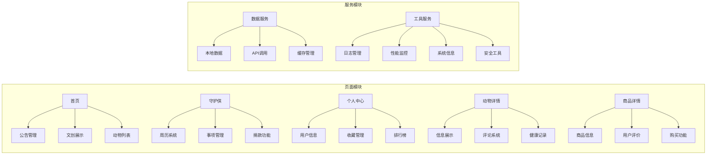
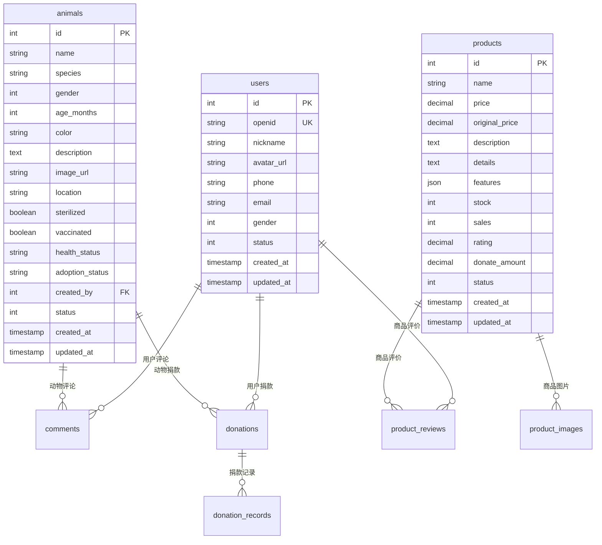
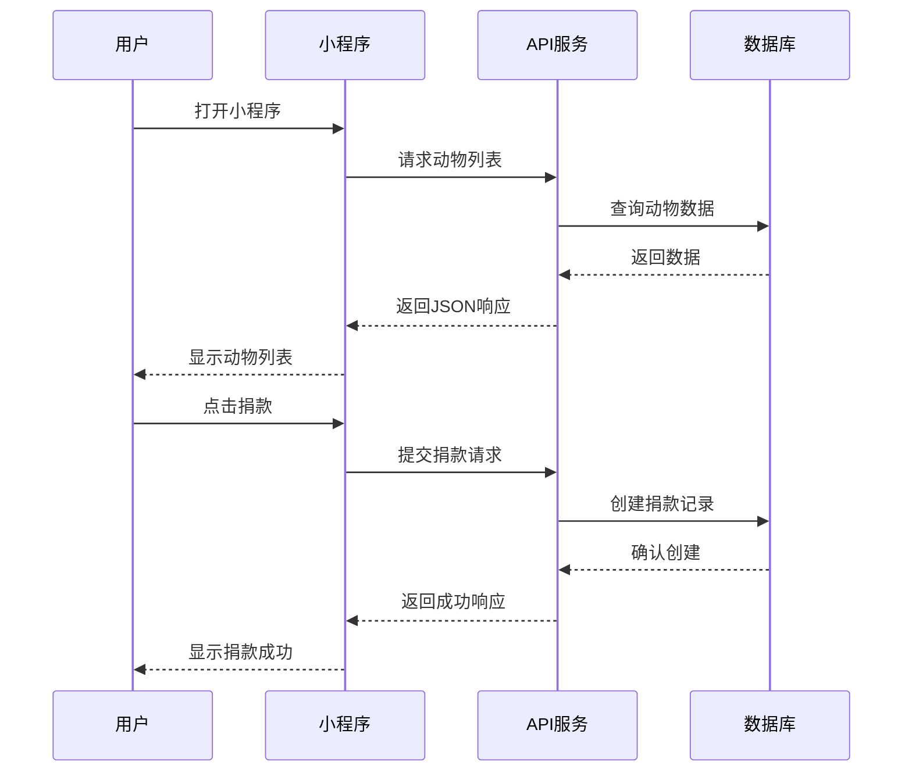

# 🐾 校园流浪动物守护小程序

[](LICENSE)
[](https://developers.weixin.qq.com/miniprogram/dev/)
[](https://nodejs.org/)
[](https://www.mysql.com/)

> 一个专为校园流浪动物管理设计的微信小程序，通过数字化手段提升校园流浪动物的关爱和管理效率。

## 📖 项目概述

### 项目简介
校园流浪动物守护小程序是一个集成了动物信息展示、捐款管理、社区互动、个人中心等功能的综合性平台。旨在通过技术手段为校园流浪动物保护提供全方位的支持，促进校园动物福利事业的发展。

### 核心价值
- 🎯 **数字化管理**: 将传统的手工记录转为数字化管理，提高效率
- 🤝 **社区参与**: 鼓励师生参与流浪动物保护，形成关爱氛围
- 📊 **数据透明**: 捐款流向透明，让每一份爱心都有迹可循
- 🔄 **持续关爱**: 建立长期跟踪机制，确保动物得到持续关注

### 功能特点
- 🏠 **智能首页**: 公告滚动、文创义卖、动物展示
- 🛡️ **守护侠日历**: 周历管理、事项跟踪、实时捐款
- 👤 **个人中心**: 用户管理、收藏功能、排行榜
- 🐕 **动物详情**: 详细信息、评论互动、健康记录
- 🛒 **商品详情**: 文创产品、用户评价、购买功能

## 🏗️ 技术架构

### 整体架构图



### 技术栈详情

#### 前端技术
- **平台**: 微信小程序
- **基础库版本**: 3.9.0+
- **开发语言**: JavaScript (ES6+)
- **样式**: WXSS (微信样式表)
- **模板**: WXML (微信标记语言)

#### 后端技术
- **运行环境**: Node.js 18+
- **Web框架**: Express.js
- **数据库**: MySQL 8.0+
- **ORM**: mysql2/promise
- **日志**: Winston
- **验证**: Joi

#### 开发工具
- **IDE**: 微信开发者工具
- **版本控制**: Git
- **包管理**: npm
- **进程管理**: PM2 (生产环境)

### 模块划分



## 🚀 安装与部署

### 环境要求

#### 开发环境
- **微信开发者工具**: 最新稳定版
- **Node.js**: 18.0.0 或更高版本
- **MySQL**: 8.0.0 或更高版本
- **Git**: 2.0.0 或更高版本

#### 生产环境
- **服务器**: Linux (推荐 Ubuntu 20.04+)
- **Node.js**: 18.0.0+
- **MySQL**: 8.0.0+
- **Nginx**: 1.18.0+ (反向代理)
- **PM2**: 4.0.0+ (进程管理)

### 前置条件

1. **微信小程序账号**
   - 注册微信小程序账号
   - 获取 AppID
   - 配置服务器域名白名单

2. **MySQL 数据库**
   - 安装 MySQL 8.0+
   - 创建数据库用户
   - 配置远程连接权限

3. **服务器环境** (可选)
   - 云服务器或 VPS
   - 域名和 SSL 证书
   - 防火墙配置

### 安装步骤

#### 1. 代码获取

```bash
# 克隆项目
git clone https://github.com/your-username/campus-animal-care-miniprogram.git

# 进入项目目录
cd campus-animal-care-miniprogram

# 查看项目结构
tree -I 'node_modules|.git'
```

#### 2. 小程序配置

```bash
# 进入小程序目录
cd miniprogram-2

# 使用微信开发者工具打开项目
# 配置 AppID: wx933d2ff5e23e50fb (或使用您自己的 AppID)
```

#### 3. 后端服务配置

```bash
# 进入后端目录
cd backend

# 安装依赖
npm install

# 复制环境配置文件
cp config.example.env .env

# 编辑环境配置
nano .env
```

#### 4. 环境变量配置

```env
# 数据库配置
DB_HOST=localhost
DB_USER=root
DB_PASSWORD=your_password
DB_NAME=campus_animal_care

# 服务器配置
PORT=3000
NODE_ENV=development

# JWT 配置
JWT_SECRET=your_jwt_secret_key

# 微信配置
WECHAT_APPID=your_wechat_appid
WECHAT_SECRET=your_wechat_secret
```

### 数据库部署与初始化

#### 1. 创建数据库

```sql
-- 登录 MySQL
mysql -u root -p

-- 执行初始化脚本
source database/init.sql

-- 导入示例数据
source database/sample_data.sql
```

#### 2. 验证数据库

```sql
-- 检查表结构
SHOW TABLES;

-- 检查数据
SELECT COUNT(*) FROM users;
SELECT COUNT(*) FROM animals;
SELECT COUNT(*) FROM products;
```

#### 3. 数据库关系图



### 本地运行指南

#### 1. 启动后端服务

```bash
# 开发模式
npm run dev

# 生产模式
npm start

# 使用 PM2
pm2 start server.js --name "campus-animal-api"
```

#### 2. 启动小程序

1. 打开微信开发者工具
2. 导入项目目录 `miniprogram-2`
3. 配置 AppID
4. 点击编译运行

#### 3. 验证部署

```bash
# 检查后端服务
curl http://localhost:3000/api/health

# 检查数据库连接
curl http://localhost:3000/api/animals

# 查看日志
pm2 logs campus-animal-api
```

## 📱 使用指南

### 用户注册与登录

#### 微信授权登录
1. 打开小程序
2. 点击"授权登录"
3. 允许获取用户信息
4. 系统自动创建用户账号

#### 用户信息完善
1. 进入个人中心
2. 点击头像区域
3. 完善个人信息
4. 保存设置

### 主要功能使用方法

#### 1. 首页功能

**查看公告**
- 首页顶部公告栏自动轮播
- 点击公告查看详细信息
- 支持紧急救助、活动通知等类型

**浏览文创产品**
- 横向滑动查看商品
- 点击商品进入详情页
- 支持商品评价和购买

**查看校园动物**
- 网格布局展示动物卡片
- 点击动物查看详细信息
- 支持收藏和评论功能

#### 2. 守护侠功能

**周历管理**
- 左右滑动切换周次
- 点击日期选择特定日期
- 自动标识今天日期

**事项跟踪**
- 根据选中日期显示相关事项
- 查看动物救助需求
- 跟踪捐款进度

**捐款功能**
- 输入捐款金额
- 实时更新进度条
- 查看捐款历史

#### 3. 个人中心功能

**用户信息管理**
- 查看个人统计数据
- 修改头像和昵称
- 设置联系方式

**收藏管理**
- 查看收藏的动物
- 管理收藏列表
- 快速访问收藏内容

**排行榜功能**
- 查看捐款排行榜
- 个人排名显示
- 激励用户参与

### 常见操作流程

#### 捐款流程
1. 进入守护侠页面
2. 选择需要帮助的动物
3. 输入捐款金额
4. 确认捐款信息
5. 完成捐款操作

#### 评论流程
1. 进入动物详情页
2. 滚动到评论区域
3. 输入评论内容
4. 提交评论
5. 查看其他用户评论

#### 商品购买流程
1. 浏览首页文创产品
2. 点击感兴趣的商品
3. 查看商品详情和评价
4. 选择购买数量
5. 确认购买信息

## 📁 项目结构

### 目录结构说明

```
campus-animal-care-miniprogram/
├── miniprogram-2/                 # 微信小程序前端
│   ├── app.js                     # 小程序入口文件
│   ├── app.json                   # 全局配置文件
│   ├── app.wxss                   # 全局样式文件
│   ├── pages/                     # 页面目录
│   │   ├── index/                 # 首页模块
│   │   │   ├── index.js           # 页面逻辑
│   │   │   ├── index.wxml         # 页面结构
│   │   │   ├── index.wxss         # 页面样式
│   │   │   └── index.json         # 页面配置
│   │   ├── calendar/              # 守护侠模块
│   │   │   ├── calendar.js        # 周历逻辑
│   │   │   ├── calendar.wxml      # 周历界面
│   │   │   ├── calendar.wxss      # 周历样式
│   │   │   └── calendar.json      # 周历配置
│   │   ├── my/                    # 个人中心模块
│   │   ├── hero/                  # 动物详情模块
│   │   └── product-detail/        # 商品详情模块
│   ├── utils/                     # 工具函数
│   │   ├── dataService.js         # 数据服务
│   │   ├── apiService.js          # API服务
│   │   ├── logger.js              # 日志管理
│   │   ├── performance.js         # 性能监控
│   │   ├── systemInfo.js          # 系统信息
│   │   ├── security.js            # 安全工具
│   │   └── errorHandler.js        # 错误处理
│   ├── config/                    # 配置文件
│   │   └── api.js                 # API配置
│   ├── data/                      # 本地数据
│   │   ├── animals.js             # 动物数据
│   │   ├── products.js            # 商品数据
│   │   ├── notices.js             # 公告数据
│   │   ├── donations.js           # 捐款数据
│   │   └── comments.js            # 评论数据
│   └── image/                     # 图片资源
│       └── dog.png                # 默认头像
├── backend/                       # 后端服务
│   ├── server.js                  # 主服务器文件
│   ├── package.json               # 依赖配置
│   ├── config/                    # 配置目录
│   │   ├── database.js            # 数据库配置
│   │   └── config.js              # 应用配置
│   ├── routes/                    # 路由目录
│   │   ├── index.js               # 路由入口
│   │   ├── user.js                # 用户路由
│   │   ├── animal.js              # 动物路由
│   │   ├── product.js             # 商品路由
│   │   ├── donation.js            # 捐款路由
│   │   ├── comment.js             # 评论路由
│   │   └── notice.js              # 公告路由
│   ├── models/                    # 数据模型
│   │   ├── BaseModel.js           # 基础模型
│   │   ├── User.js                # 用户模型
│   │   ├── Animal.js              # 动物模型
│   │   ├── Product.js             # 商品模型
│   │   ├── Donation.js            # 捐款模型
│   │   ├── Comment.js             # 评论模型
│   │   └── Notice.js              # 公告模型
│   ├── middleware/                # 中间件
│   │   ├── errorHandler.js        # 错误处理
│   │   └── validation.js          # 数据验证
│   └── utils/                     # 工具函数
│       └── logger.js              # 日志工具
├── database/                      # 数据库相关
│   ├── init.sql                   # 初始化脚本
│   ├── sample_data.sql            # 示例数据
│   ├── API_接口文档.md            # API文档
│   ├── 集成指南.md                # 集成指南
│   ├── 测试文档.md                # 测试文档
│   └── 部署指南.md                # 部署指南
├── docs/                          # 项目文档
│   ├── API迁移指南.md             # API迁移指南
│   └── 问题修复报告.md            # 问题修复报告
└── README.md                      # 项目说明文档
```

### 核心文件功能解释

#### 前端核心文件

| 文件路径 | 功能描述 | 重要性 |
|---------|---------|--------|
| `app.js` | 小程序入口，全局生命周期管理 | ⭐⭐⭐⭐⭐ |
| `app.json` | 全局配置，页面路由和tabBar设置 | ⭐⭐⭐⭐⭐ |
| `utils/dataService.js` | 数据服务层，统一数据访问接口 | ⭐⭐⭐⭐⭐ |
| `utils/apiService.js` | API服务封装，网络请求管理 | ⭐⭐⭐⭐ |
| `pages/index/index.js` | 首页逻辑，公告和商品展示 | ⭐⭐⭐⭐ |
| `pages/calendar/calendar.js` | 守护侠逻辑，周历和捐款管理 | ⭐⭐⭐⭐ |

#### 后端核心文件

| 文件路径 | 功能描述 | 重要性 |
|---------|---------|--------|
| `server.js` | Express服务器入口，中间件配置 | ⭐⭐⭐⭐⭐ |
| `config/database.js` | 数据库连接池配置 | ⭐⭐⭐⭐⭐ |
| `models/BaseModel.js` | 基础数据模型，CRUD操作 | ⭐⭐⭐⭐⭐ |
| `routes/index.js` | 路由入口，API路由聚合 | ⭐⭐⭐⭐ |
| `middleware/errorHandler.js` | 全局错误处理中间件 | ⭐⭐⭐⭐ |

## 🔌 API文档

### 主要接口说明

#### 用户相关接口

```http
# 用户登录/注册
POST /api/user/login
Content-Type: application/json

{
  "openid": "user_openid",
  "nickname": "用户昵称",
  "avatar_url": "头像URL"
}

# 获取用户信息
GET /api/user/info?openid=user_openid
```

#### 动物相关接口

```http
# 获取动物列表
GET /api/animals?page=1&limit=10&species=cat

# 获取动物详情
GET /api/animals/:id

# 创建动物信息
POST /api/animals
Content-Type: application/json

{
  "name": "小橘",
  "species": "cat",
  "gender": 1,
  "description": "友善的橘猫"
}
```

#### 商品相关接口

```http
# 获取商品列表
GET /api/products?page=1&limit=10

# 获取商品详情
GET /api/products/:id

# 获取商品评价
GET /api/products/:id/reviews

# 添加商品评价
POST /api/products/:id/reviews
Content-Type: application/json

{
  "user_id": 1,
  "rating": 5,
  "content": "质量很好，支持流浪动物救助！"
}
```

#### 捐款相关接口

```http
# 获取捐款项目列表
GET /api/donations

# 创建捐款记录
POST /api/donations/:id/donate
Content-Type: application/json

{
  "user_id": 1,
  "amount": 50.00,
  "payment_method": "wechat"
}
```

### 数据交互流程



## 🗄️ 数据库设计

### 核心表结构说明

#### 用户表 (users)
```sql
CREATE TABLE users (
    id INT PRIMARY KEY AUTO_INCREMENT,
    openid VARCHAR(50) UNIQUE NOT NULL COMMENT '微信openid',
    nickname VARCHAR(100) NOT NULL COMMENT '用户昵称',
    avatar_url VARCHAR(500) COMMENT '头像URL',
    phone VARCHAR(20) COMMENT '手机号',
    email VARCHAR(100) COMMENT '邮箱',
    gender TINYINT DEFAULT 0 COMMENT '性别: 0-未知, 1-男, 2-女',
    status TINYINT DEFAULT 1 COMMENT '状态: 0-禁用, 1-正常',
    created_at TIMESTAMP DEFAULT CURRENT_TIMESTAMP,
    updated_at TIMESTAMP DEFAULT CURRENT_TIMESTAMP ON UPDATE CURRENT_TIMESTAMP
);
```

#### 动物信息表 (animals)
```sql
CREATE TABLE animals (
    id INT PRIMARY KEY AUTO_INCREMENT,
    name VARCHAR(50) NOT NULL COMMENT '动物姓名',
    species VARCHAR(20) NOT NULL COMMENT '物种: cat, dog, other',
    gender TINYINT NOT NULL COMMENT '性别: 0-未知, 1-公, 2-母',
    age_months INT COMMENT '年龄(月)',
    color VARCHAR(50) COMMENT '毛色',
    description TEXT COMMENT '描述',
    image_url VARCHAR(500) COMMENT '头像图片URL',
    location VARCHAR(200) COMMENT '常出现地点',
    sterilized BOOLEAN DEFAULT FALSE COMMENT '是否已绝育',
    vaccinated BOOLEAN DEFAULT FALSE COMMENT '是否已接种疫苗',
    health_status VARCHAR(20) DEFAULT 'healthy' COMMENT '健康状态',
    adoption_status VARCHAR(20) DEFAULT 'wild' COMMENT '收养状态',
    created_by INT COMMENT '创建者用户ID',
    status TINYINT DEFAULT 1 COMMENT '状态: 0-删除, 1-正常',
    created_at TIMESTAMP DEFAULT CURRENT_TIMESTAMP,
    updated_at TIMESTAMP DEFAULT CURRENT_TIMESTAMP ON UPDATE CURRENT_TIMESTAMP
);
```

#### 商品表 (products)
```sql
CREATE TABLE products (
    id INT PRIMARY KEY AUTO_INCREMENT,
    name VARCHAR(100) NOT NULL COMMENT '商品名称',
    price DECIMAL(10,2) NOT NULL COMMENT '现价',
    original_price DECIMAL(10,2) COMMENT '原价',
    description TEXT COMMENT '商品描述',
    details TEXT COMMENT '商品详情',
    features JSON COMMENT '商品特色',
    stock INT DEFAULT 0 COMMENT '库存数量',
    sales INT DEFAULT 0 COMMENT '销量',
    rating DECIMAL(3,2) DEFAULT 0.00 COMMENT '评分',
    donate_amount DECIMAL(10,2) DEFAULT 0.00 COMMENT '捐赠金额',
    status TINYINT DEFAULT 1 COMMENT '状态: 0-下架, 1-上架',
    created_at TIMESTAMP DEFAULT CURRENT_TIMESTAMP,
    updated_at TIMESTAMP DEFAULT CURRENT_TIMESTAMP ON UPDATE CURRENT_TIMESTAMP
);
```

## 🛠️ 开发与贡献

### 开发规范

#### 代码规范
- **JavaScript**: 使用 ES6+ 语法，遵循 Airbnb 规范
- **WXSS**: 使用 BEM 命名规范，保持样式模块化
- **WXML**: 使用语义化标签，保持结构清晰
- **注释**: 关键函数和复杂逻辑必须添加注释

#### 文件命名
- **页面文件**: 使用小写字母和连字符，如 `product-detail.js`
- **工具文件**: 使用驼峰命名，如 `dataService.js`
- **图片文件**: 使用描述性名称，如 `dog-avatar.png`

#### Git 提交规范
```bash
# 提交格式
<type>(<scope>): <subject>

# 类型说明
feat: 新功能
fix: 修复bug
docs: 文档更新
style: 代码格式调整
refactor: 代码重构
test: 测试相关
chore: 构建过程或辅助工具的变动

# 示例
feat(calendar): 添加周历切换功能
fix(api): 修复捐款接口参数验证问题
docs(readme): 更新安装指南
```

### 贡献指南

#### 1. Fork 项目
```bash
# Fork 项目到自己的 GitHub 账号
# 克隆到本地
git clone https://github.com/your-username/campus-animal-care-miniprogram.git
cd campus-animal-care-miniprogram
```

#### 2. 创建功能分支
```bash
# 创建并切换到新分支
git checkout -b feature/your-feature-name

# 或者修复bug
git checkout -b fix/your-bug-description
```

#### 3. 开发与测试
```bash
# 安装依赖
npm install

# 运行测试
npm test

# 启动开发服务器
npm run dev
```

#### 4. 提交代码
```bash
# 添加修改的文件
git add .

# 提交代码
git commit -m "feat(calendar): 添加周历切换功能"

# 推送到远程仓库
git push origin feature/your-feature-name
```

#### 5. 创建 Pull Request
- 在 GitHub 上创建 Pull Request
- 详细描述修改内容
- 关联相关 Issue
- 等待代码审查

### 代码审查标准

#### 功能完整性
- [ ] 功能按需求实现
- [ ] 边界条件处理完善
- [ ] 错误处理机制健全

#### 代码质量
- [ ] 代码结构清晰
- [ ] 命名规范统一
- [ ] 注释完整准确
- [ ] 无重复代码

#### 性能考虑
- [ ] 避免不必要的重复计算
- [ ] 合理使用缓存机制
- [ ] 优化网络请求

#### 安全性
- [ ] 输入数据验证
- [ ] 防止SQL注入
- [ ] 敏感信息保护

## ❓ 常见问题

### 开发环境问题

#### Q: 微信开发者工具无法打开项目
**A:** 检查以下几点：
1. 确保使用最新版本的微信开发者工具
2. 检查项目路径中是否包含中文字符
3. 确认 `app.json` 文件格式正确
4. 重新导入项目

#### Q: 数据库连接失败
**A:** 按以下步骤排查：
1. 检查 MySQL 服务是否启动
2. 验证数据库连接参数
3. 确认数据库用户权限
4. 检查防火墙设置

```bash
# 检查 MySQL 状态
systemctl status mysql

# 测试数据库连接
mysql -h localhost -u root -p
```

#### Q: API 请求失败
**A:** 检查以下配置：
1. 确认后端服务已启动
2. 检查 API 地址配置
3. 验证网络连接
4. 查看控制台错误信息

### 部署问题

#### Q: 生产环境部署失败
**A:** 按以下步骤操作：
1. 检查服务器环境配置
2. 确认依赖安装完整
3. 验证数据库连接
4. 检查端口占用情况

```bash
# 检查端口占用
netstat -tlnp | grep :3000

# 检查进程状态
pm2 status
```

#### Q: 小程序审核不通过
**A:** 注意以下要点：
1. 确保功能完整可用
2. 检查用户隐私政策
3. 验证数据安全措施
4. 完善用户协议

### 功能问题

#### Q: 周历显示异常
**A:** 可能的原因：
1. 日期计算逻辑错误
2. 数据格式不正确
3. 时区设置问题
4. 缓存数据过期

#### Q: 捐款功能异常
**A:** 检查以下方面：
1. 金额输入验证
2. 网络请求状态
3. 数据库事务处理
4. 用户权限验证

### 技术支持联系方式

- **GitHub Issues**: [项目Issues页面](https://github.com/your-username/campus-animal-care-miniprogram/issues)
- **邮箱支持**: support@campus-animal-care.com
- **技术交流群**: 微信群二维码 (待添加)
- **文档中心**: [项目Wiki](https://github.com/your-username/campus-animal-care-miniprogram/wiki)

## 📄 许可证信息

### 开源协议
本项目采用 [MIT License](LICENSE) 开源协议。

### 协议条款
```
MIT License

Copyright (c) 2024 校园流浪动物守护小程序

Permission is hereby granted, free of charge, to any person obtaining a copy
of this software and associated documentation files (the "Software"), to deal
in the Software without restriction, including without limitation the rights
to use, copy, modify, merge, publish, distribute, sublicense, and/or sell
copies of the Software, and to permit persons to whom the Software is
furnished to do so, subject to the following conditions:

The above copyright notice and this permission notice shall be included in all
copies or substantial portions of the Software.

THE SOFTWARE IS PROVIDED "AS IS", WITHOUT WARRANTY OF ANY KIND, EXPRESS OR
IMPLIED, INCLUDING BUT NOT LIMITED TO THE WARRANTIES OF MERCHANTABILITY,
FITNESS FOR A PARTICULAR PURPOSE AND NONINFRINGEMENT. IN NO EVENT SHALL THE
AUTHORS OR COPYRIGHT HOLDERS BE LIABLE FOR ANY CLAIM, DAMAGES OR OTHER
LIABILITY, WHETHER IN AN ACTION OF CONTRACT, TORT OR OTHERWISE, ARISING FROM,
OUT OF OR IN CONNECTION WITH THE SOFTWARE OR THE USE OR OTHER DEALINGS IN THE
SOFTWARE.
```

### 使用说明
- ✅ 允许商业使用
- ✅ 允许修改和分发
- ✅ 允许私人使用
- ❌ 不提供任何担保
- ❌ 不承担任何责任

## 🙏 致谢

### 贡献者名单

感谢以下开发者为项目做出的贡献：

- **项目发起人**: 负责整体架构设计和核心功能开发
- **UI设计师**: 负责界面设计和用户体验优化
- **后端开发**: 负责API接口和数据库设计
- **测试工程师**: 负责功能测试和性能优化
- **文档维护**: 负责文档编写和维护

### 特别感谢

- **微信小程序团队**: 提供优秀的开发平台和工具
- **开源社区**: 提供丰富的开源组件和解决方案
- **校园动物保护组织**: 提供宝贵的业务需求和建议
- **所有用户**: 提供反馈和建议，帮助项目不断完善

### 技术栈致谢

- [微信小程序](https://developers.weixin.qq.com/miniprogram/dev/) - 开发平台
- [Node.js](https://nodejs.org/) - 后端运行环境
- [Express.js](https://expressjs.com/) - Web应用框架
- [MySQL](https://www.mysql.com/) - 数据库系统
- [Winston](https://github.com/winstonjs/winston) - 日志管理
- [Joi](https://github.com/hapijs/joi) - 数据验证

---

<div align="center">

**🐾 让每一份爱心都有迹可循，让每一个生命都得到关爱 🐾**

[](https://github.com/your-username/campus-animal-care-miniprogram)
[](https://github.com/your-username/campus-animal-care-miniprogram/fork)
[](https://github.com/your-username/campus-animal-care-miniprogram/issues)

</div>
